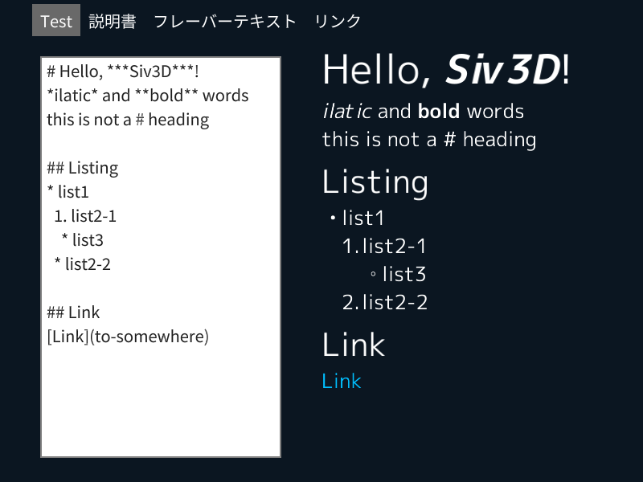
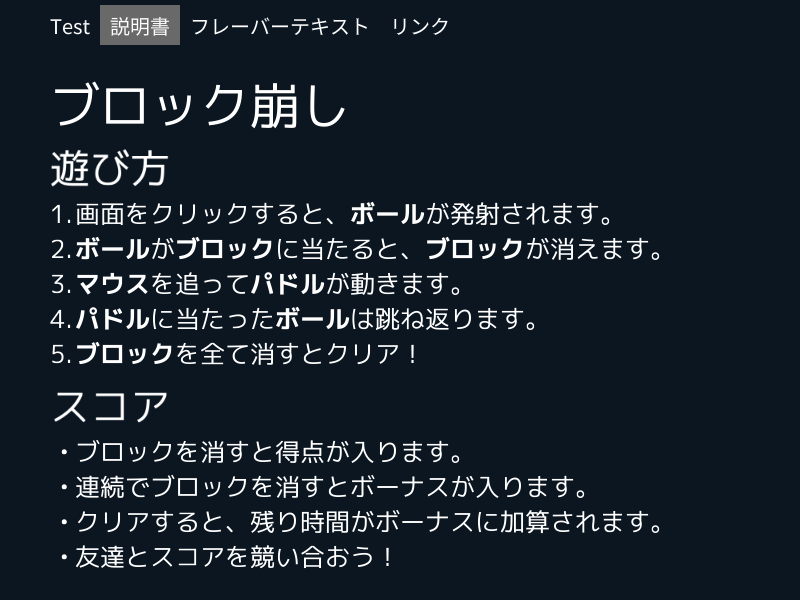
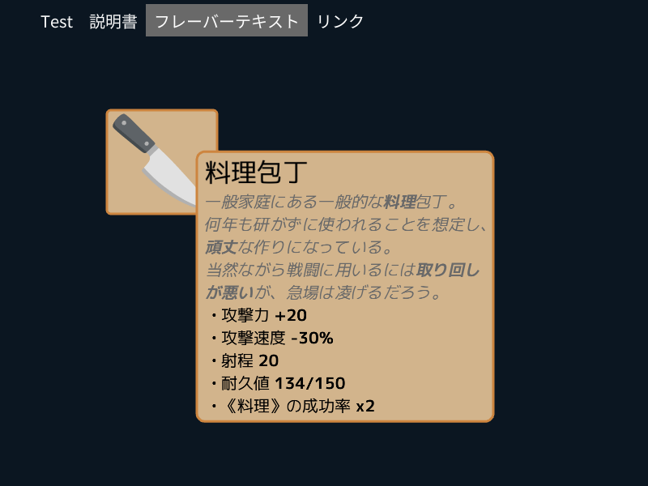
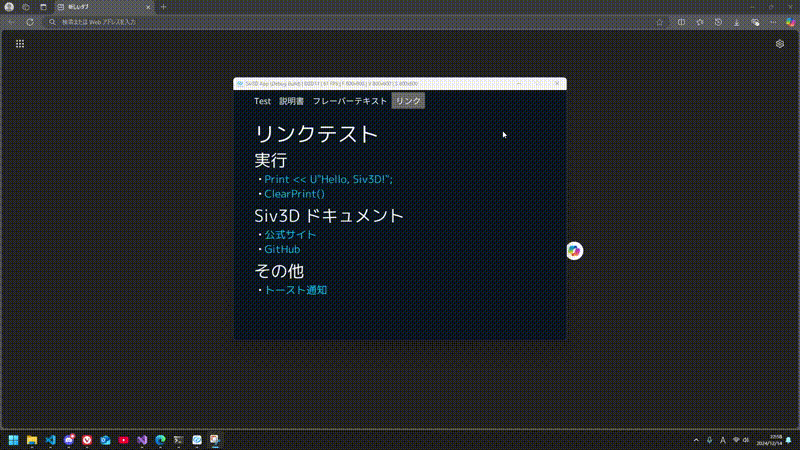

# Siv3D で Markdown を描画する

## 動機

構造を持った文章や装飾のある文字列を画面内に表示したいとき、あると思います。
例えば

- アプリの説明をするとき
  - ゲームでの操作方法
  - 開発者や協力者のクレジット表示
  - ライセンスや依存ライブラリの情報
- 項目の詳細を表示するとき
  - ゲームでのアイテムの効果やフレーバーテキスト
  - ツールのボタンの説明をポップアップで

など。
このような文章を書く際、Markdown は非常に便利です。

Siv3D でも Markdown で書いた文章を描画したい。
そんな思いから、Siv3D で Markdown を描画するクラスを作ってみました。

## 作成したもの

https://github.com/MrMocchy/Siv3D-MarkdownText

なお、対応した記法は以下のもののみです。

- 見出し (h1 ~ h6)
- 強調 (strong, italic, 両方)
- リスト (unordered, ordered)
- リンク (任意のコードの実行)

今回作成したこのクラス、出来（描画結果や機能）は自分にしてはかなりいいのではと思っています。
しかしコードの方はとてもお見せできるものではないです。
参考以下に見ていただければと思います。

## 概要

最もシンプルな使い方は以下のようになります。

```cpp

void Main(){
  MarkdownTextStyle style{20};
  // stylee.strongColor = Color{ 36, 145, 212 };
  MarkdownText md{ U"Hello, **Siv3D**!", style };
  
  while (System::Update()){
    md.draw({ 100, 100 });
  }
}
```

描画例としては以下のような感じです。









## 中身

読む価値ないですが、自分の考えの記録として。

### クラスの構造

`MarkdownText` クラスがメインで、以下のような構造です。

```cpp
class MarkdownText
{
public:
	String markdown;
	MarkdownTextStyle style;

	MarkdownText(String markdown, MarkdownTextStyle style);

	RectF draw(const Vec2& topLeftPos, const double width = Math::Inf);

	RectF region(const Vec2& topLeftPos, const double width = Math::Inf);

	void build();

private:

	double m_width = -1;

	struct GlyphInfo
	{
		Glyph glyph;
		Vec2 pos;
		double scale;
		Color color;
		std::function<void()> callback;
		RectF callbackHitbox;
	};
	Array<GlyphInfo> m_glyphInfos;

	Vec2 addGlyph(...);
	Vec2 addGlyphs(...);
};
```

これは `MarkdownTextStyle` クラスの変数を持ちます。
これは表示する文字のスタイルを指定するためのもので、強調などのフォント、Heading のフォントサイズ、文字色などを格納します。

スタイルについては置いておいて、`MarkdownText` の処理の説明をします。
コンストラクタでは、与えられた Markdown 文字列とスタイルを受け取り格納だけします。
`build` メソッドを呼び出すことで、Markdown 文字列を解析し、描画するためのグリフ情報を生成します。

描画する際は `draw` メソッドを呼び出します。
その引数には描画する左上の座標と、描画する領域の幅（デフォルトは無限）を指定します。
幅が前回と異なると `build` メソッドが呼ばれ、グリフ情報を更新します。
`region` メソッドは描画しない `draw` です。

グリフ情報というのは、どのフォントのどの文字を（Glyph）、どこに(Vec2)、どの大きさで(double)、どの色で(Color)描画するかを格納します。
一度この情報を生成すると、内容が変わらない限りはこれを使って描画するだけでいいので効率がいいです。この方法は `SimpleGUI::TextArea` (`TextAreaEditState`) の実装を参考にしました。

マウスカーソルに追従するツールチップのようなものを表示する際、カーソルが画面端に近いときには描画範囲を変更する必要があるので、`draw` メソッドの引数に幅を指定できるようにしました。
しかしよく考えると、これは単に描画位置を変えればいいだけですし、描画範囲を狭めても見にくくなってしまうので、この機能は不要だと気づきました。

一方、文字列やスタイルが変わったときには手動で `build` メソッドを呼ぶ必要があります。スタイルがもつ変数が多いために面倒だと思ったのが始めの理由でしたが、利用用途からして描画内容は滅多に変わらないと思われるので、これは問題ないと考えました。

### Markdown 文字列からグリフ情報の生成

調べた限りの Markdown パーサは HTML に変換することを目的としたものばかりで、そのほとんどが構文木を生成していました。
そんなものを得ても描画するための情報に変換するのはまた別の手間がかかるので、全く別の方法で実装しました。

といっても単純に、頭から正規表現で Markdown の構文を解析して、状態を変化させるだけのものです。
例えば、`**` を発見したら強調の開始として、それ以降の文字を強調のフォントで描画するようにします。再度 `**` を発見したり、行末に達したら強調の終了として、通常のフォントで描画するようにします。	
リストは ordered/unordered やネストのために複雑になりましたが、基本的には同じです。

そして描画する文字を1つずつ、その時の状態に応じて描画するフォントや色などのグリフ情報を記録していきます。

### リンク

リンクは、キー文字列とそれで呼ばれる関数をスタイルのクラスの `HashTable` に登録しておきます。
通常のリンクの型式 `[表示文字列](キー文字列)` で、表示文字列をクリックするとキー文字列に対応する関数が呼ばれます。例えば

```cpp
style.callbackTable[U"Siv3D_HP"] = []() {
  System::LaunchBrowser(U"https://siv3d.github.io/");
};
```

とすると、Markdown で `[Siv3Dホームページ](Siv3D_HP)` と書いたときに、`Siv3Dホームページ` をクリックするとブラウザで開かれ、本来のリンクと同じように振る舞います。
ですがもちろんこれ以外の関数オブジェクトを登録することもできるので、他の用途にも使えます。例えばゲームのアイテムの効果説明に用いれば、「攻撃力」をクリックするとヘルプ画面に遷移するなどの使い方が考えられます。

## 参考

[Siv3D/OpenSiv3D/.../SivTextAreaEditState.cpp - GitHub](https://github.com/Siv3D/OpenSiv3D/blob/main/Siv3D/src/Siv3D/TextAreaEditState/SivTextAreaEditState.cpp)

[FFmpegで動画をGIFに変換 - Qiita](https://qiita.com/wMETAw/items/fdb754022aec1da88e6e)

